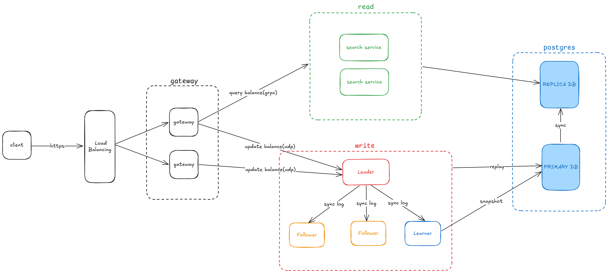

**Aeron-Bank** is a distributed banking system optimized for high transaction write performance, utilizing **Aeron
Cluster Raft** technology combined with distributed storage methods to ensure consistency and reliability in a
multi-node environment. By applying the **Raft Consensus** principle, the system maintains data synchronization across
nodes in the cluster, enabling ultra-fast transaction processing with low latency.

Transaction data is temporarily stored in memory or files on the system's nodes. After transactions are processed and
validated, the system performs a **snapshot** (capturing the data state at a specific point in time) and saves it to a
database (DB) to ensure data durability and recovery capability in case of a failure.

In the event of a failure, even a **severe failure** that causes the entire cluster to go down, the system can still *
*replay the transaction state** from the **Raft log** and the most recent **snapshot** stored in the database (DB). The
Raft log contains a complete sequence of all committed transactions, and by replaying these logs from the point of the
last successful snapshot, the system can restore itself to its last consistent state. This process ensures that no
transaction data is lost, even after catastrophic failures, and guarantees the system’s integrity and recovery.

